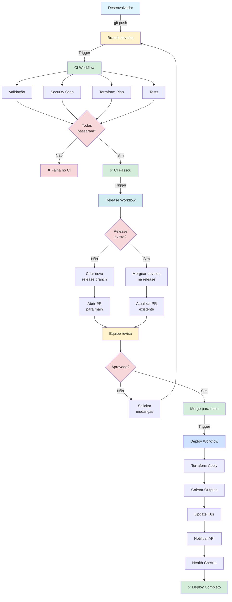
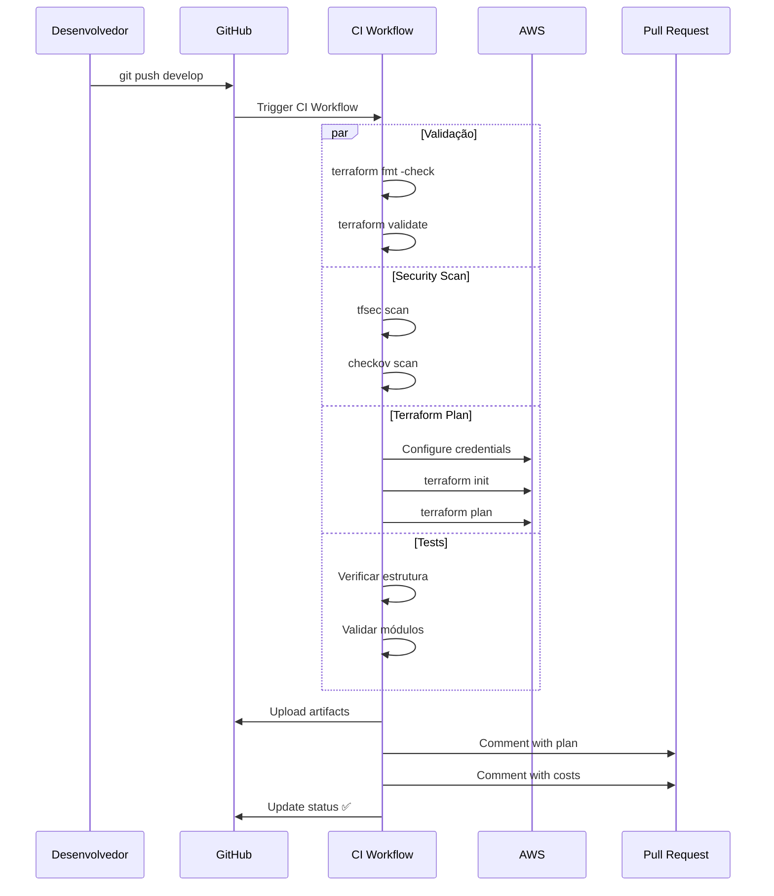
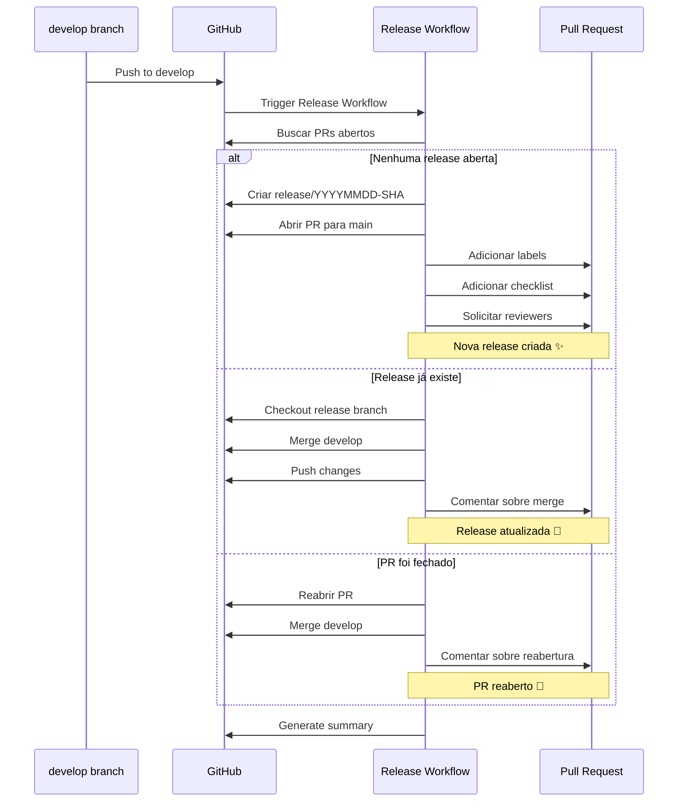
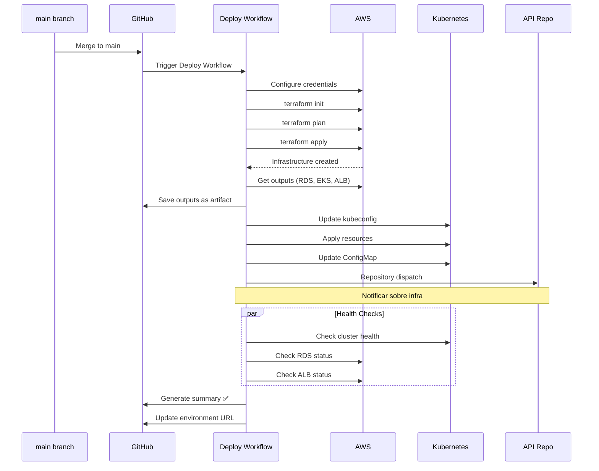
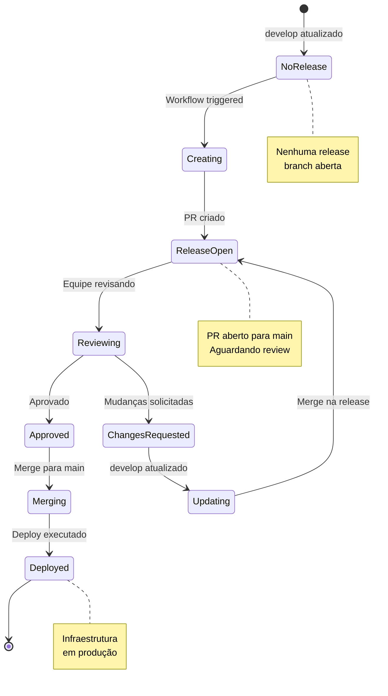
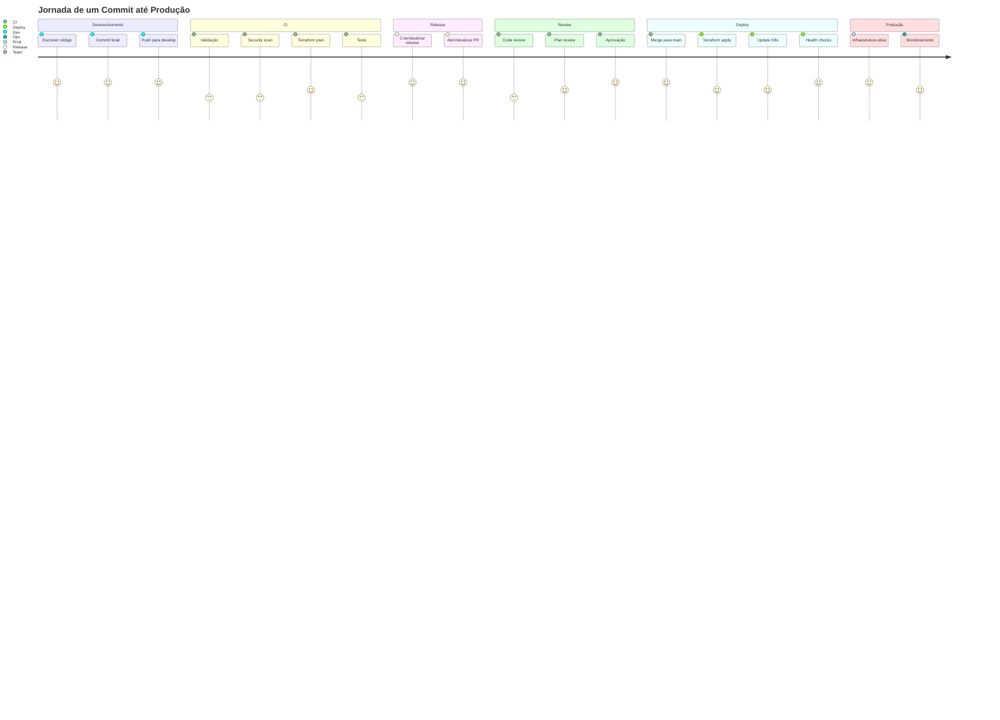
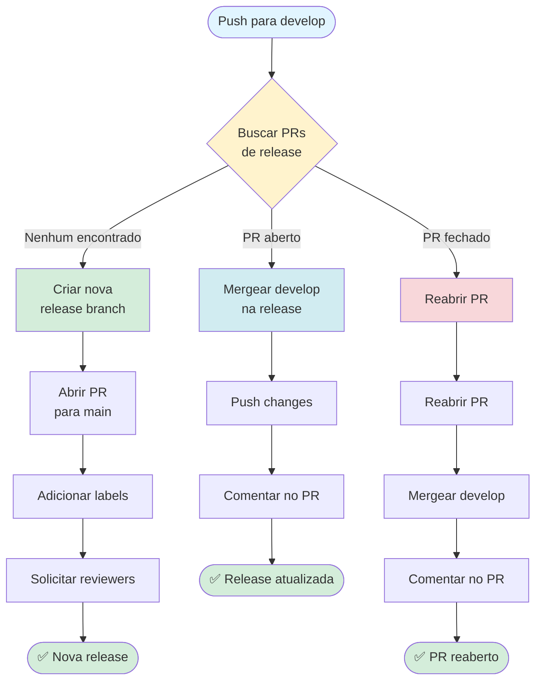
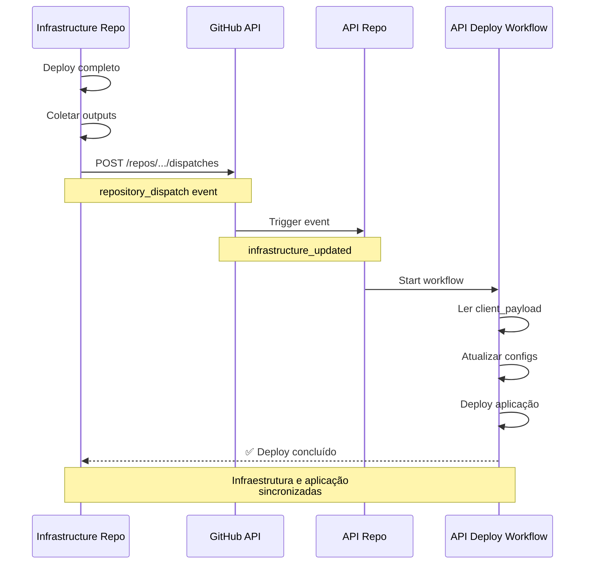
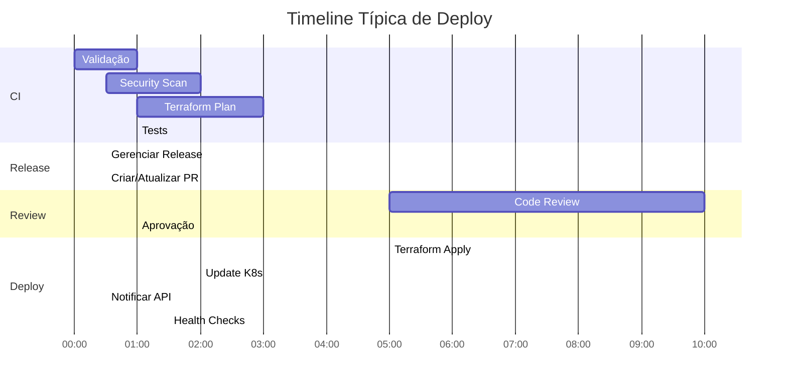
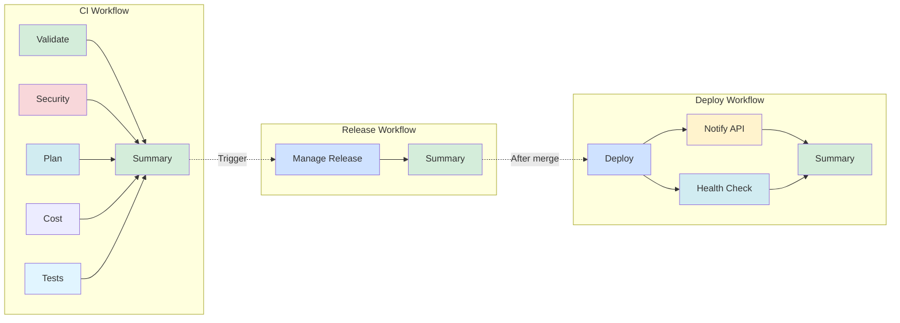

# 🔄 Fluxo de CI/CD - Diagrama Visual

## Visão Geral do Fluxo

---

## Fluxo Detalhado do CI

---

## Fluxo Detalhado do Release

---

## Fluxo Detalhado do Deploy

---

## Estados do Release Branch

---

## Ciclo de Vida de um Commit

---

## Decisões do Release Workflow

---

## Integração com API Repository

---

## Timeline de Execução

---

## Arquitetura dos Workflows

---

## Legenda

- 🟢 **Verde**: Sucesso / Aprovado
- 🟡 **Amarelo**: Em andamento / Aguardando
- 🔵 **Azul**: Informação / Processo
- 🔴 **Vermelho**: Erro / Decisão crítica

---

**Este diagrama é atualizado automaticamente conforme os workflows evoluem.**
