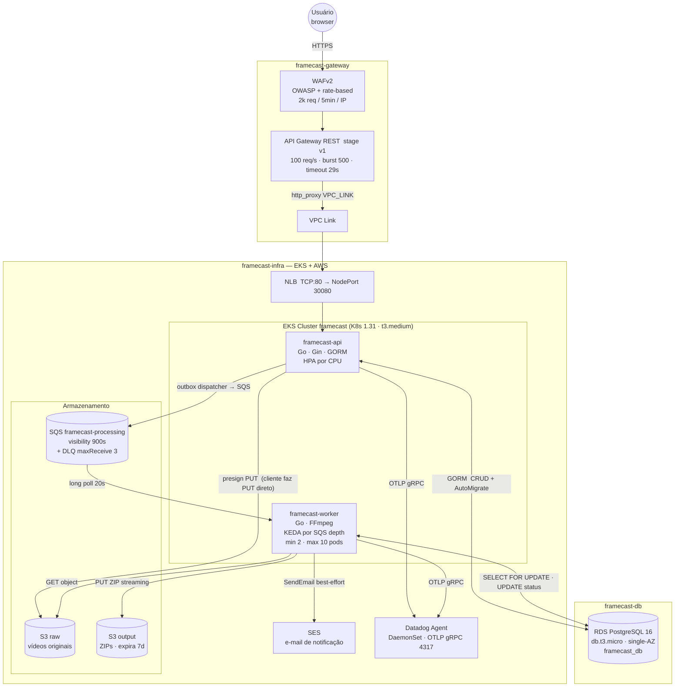
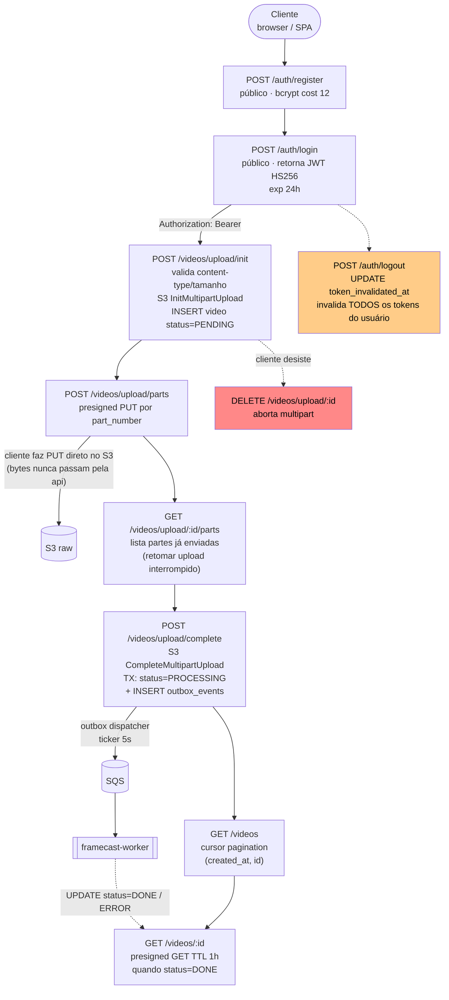
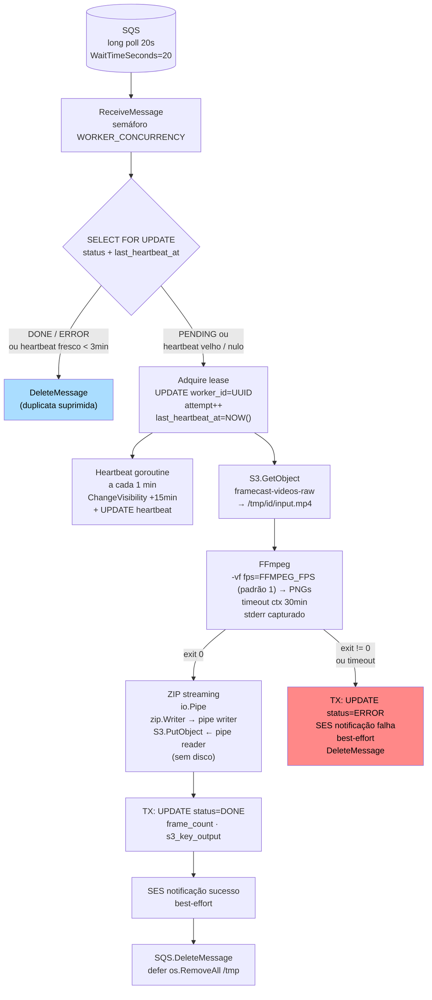

# Framecast

Pipeline distribuído de extração de frames de vídeo — FIAP X Hackathon. O usuário faz upload de um vídeo; o sistema extrai frames com FFmpeg (taxa configurável via `FFMPEG_FPS`, padrão 1 frame/segundo), empacota em ZIP e notifica por e-mail.

**5 repositórios:** `framecast-api` · `framecast-worker` · `framecast-infra` · `framecast-db` · `framecast-gateway`

---

## Arquitetura — Alto Nível



> O cliente nunca envia bytes de vídeo para a `api` — o upload vai direto ao S3 via **presigned PUT URL**. A `api` orquestra apenas mensagens de controle (JSON).

---

## Arquitetura — Baixo Nível

### framecast-api — Fluxo dos Endpoints



| Método | Rota                                         | Auth    | O que faz                                                           |
| ------ | -------------------------------------------- | ------- | ------------------------------------------------------------------- |
| POST   | `/api/auth/register`                         | público | Cria usuário (bcrypt cost 12)                                       |
| POST   | `/api/auth/login`                            | público | Valida credenciais → JWT HS256 (exp 24h)                            |
| POST   | `/api/auth/logout`                           | Bearer  | `UPDATE token_invalidated_at` — invalida todos os tokens do usuário |
| POST   | `/api/videos/upload/init`                    | Bearer  | Abre multipart no S3, cria vídeo `PENDING`                          |
| POST   | `/api/videos/upload/parts`                   | Bearer  | Presigned PUT por `part_number` — bytes vão direto ao S3            |
| GET    | `/api/videos/upload/:id/parts`               | Bearer  | Lista partes já enviadas (retomar upload)                           |
| POST   | `/api/videos/upload/complete`                | Bearer  | Fecha multipart; TX atômica `status=PROCESSING` + evento outbox     |
| DELETE | `/api/videos/upload/:id`                     | Bearer  | Aborta o multipart antes do complete                                |
| GET    | `/api/videos`                                | Bearer  | Lista paginada (cursor `created_at, id`)                            |
| GET    | `/api/videos/:id`                            | Bearer  | Detalhe + presigned GET (TTL 1h) do ZIP quando `DONE`               |
| GET    | `/health` · `/health/live` · `/health/ready` | público | Liveness/readiness                                                  |
| GET    | `/swagger/*any`                              | público | Swagger UI (gerado via swaggo/swag)                                 |
| GET    | `/*`                                         | público | SPA (`index.html`, `app.js`, `style.css`)                           |

**Pontos críticos:** `complete` é idempotente — se o vídeo já está `PROCESSING`/`DONE`, não republica o evento outbox. Recursos de outro usuário retornam **404** (não 403). Diagrama de módulos (Clean Architecture) em [`framecast-api/CLAUDE.md`](framecast-api/CLAUDE.md) e `framecast-api/docs/architecture.md`.

---

### framecast-worker — Pipeline de Processamento



**Falhas e retentabilidade:**

| Falha                                   | Comportamento                                                             |
| --------------------------------------- | ------------------------------------------------------------------------- |
| Worker crasha                           | Heartbeat para → visibility expira → SQS reentrega → idempotência protege |
| Download S3 falha                       | Não deleta msg → reentrega; após 3× → DLQ                                 |
| FFmpeg falha (codec/corrompido/timeout) | Não-retentável: `status=ERROR`, e-mail, `DeleteMessage`                   |
| ZIP / upload S3 falha                   | Não deleta msg → reentrega; após 3× → DLQ (mesmo caminho de download S3)  |
| SES falha                               | Best-effort: logado, não bloqueia ACK                                     |
| Mensagem duplicada (at-least-once SQS)  | `FOR UPDATE` + check `heartbeat` descarta silenciosamente                 |

---

## Repositórios

| Repo                | Linguagem | O que faz                                                                        | Blast radius       |
| ------------------- | --------- | -------------------------------------------------------------------------------- | ------------------ |
| `framecast-infra`   | Terraform | EKS · NLB · S3 · SQS · SES · KEDA · metrics-server · Datadog Agent · 11 monitors | Infra completa     |
| `framecast-db`      | Terraform | RDS PostgreSQL 16 · Subnet Group · Security Group                                | **Perda de dados** |
| `framecast-gateway` | Terraform | API Gateway REST · VPC Link · WAFv2                                              | Edge routing       |
| `framecast-api`     | Go 1.25   | Modular monolith: auth · videos · status · outbox + frontend SPA                 | Deploy api         |
| `framecast-worker`  | Go 1.25   | Consumer SQS: FFmpeg + ZIP streaming + SES inline                                | Deploy worker      |

---

## Ordem obrigatória de deploy

```
1. framecast-infra   ← cria EKS, NLB, SQS, S3, SES, KEDA
2. framecast-db      ← lê SGs do EKS via remote state do infra; cria RDS
3. framecast-api  ┐
   framecast-worker ├── paralelos (requerem infra + db prontos)
   framecast-gateway ┘
```

> `framecast-db` **não pode ser aplicado antes de `framecast-infra`** — ele consome `eks_security_group_id` e `eks_cluster_security_group_id` do remote state do infra para criar as regras de ingress do RDS.

> Sem DynamoDB lock no backend S3 — nunca execute dois `terraform apply` em paralelo no mesmo repo.

---

## Decisões arquiteturais

### 1. Outbox pattern + SQS

**Decisão:** ao completar o upload, a `api` abre uma transação que (1) atualiza `status=PROCESSING` e (2) insere em `outbox_events`. Um dispatcher goroutine publica no SQS a partir da tabela.

**Por quê:** se a publicação SQS fosse feita direto no handler HTTP, uma queda do SQS entre o UPDATE e o SendMessage deixaria o vídeo "PROCESSING para sempre" sem mensagem na fila. A TX de banco garante que o evento **nunca se perde** mesmo com SQS instável ou pod reiniciando.

---

### 2. Upload direto ao S3 via presigned URL

**Decisão:** a `api` nunca recebe bytes de vídeo. Ela gera presigned PUT URLs; o cliente faz PUT direto no S3.

**Por quê:** um arquivo de 2 GB passando pela `api` consumiria toda a memória do pod (`db.t3.micro` no proxy), bloquearia o handler por minutos e escalaria o EKS por CPU/memória ao invés de por carga real. Presigned URLs removem o bottleneck do plano de controle.

---

### 3. Idempotência por `SELECT FOR UPDATE` + heartbeat

**Decisão:** o worker faz `SELECT ... FOR UPDATE` antes de processar; verifica `last_heartbeat_at` para distinguir "worker vivo processando" de "heartbeat parado = worker morreu".

**Por quê:** SQS é _at-least-once_ — a mesma mensagem pode ser entregue duas vezes. Sem esse mecanismo, dois workers processariam o mesmo vídeo em paralelo, corrompendo o ZIP de saída e desperdiçando CPU/FFmpeg.

---

### 4. Logout por `token_invalidated_at` (sem Redis)

**Decisão:** `POST /auth/logout` faz `UPDATE users SET token_invalidated_at = NOW()`. O middleware rejeita tokens com `iat < token_invalidated_at`.

**Por quê:** Redis não está disponível (AWS Academy LabRole é imprevisível com ElastiCache; custo extra). O custo é uma leitura do usuário por request autenticado — que já era necessária para o contexto de ownership. Tradeoff aceito: um logout invalida **todos** os tokens ativos do usuário simultaneamente.

---

### 5. ZIP streaming com `io.Pipe`

**Decisão:** o worker usa `io.Pipe` para conectar `zip.Writer` (goroutine A) ao `S3.PutObject` (goroutine B) sem materializar o ZIP em disco.

**Por quê:** um vídeo de 2 GB gera centenas de PNGs que comprimidos podem ultrapassar o disco efêmero do pod (`/tmp` no EKS). O streaming mantém uso de memória limitado ao buffer do pipe e elimina a necessidade de disco extra.

---

### 6. KEDA `minReplicaCount: 2`

**Decisão:** o ScaledObject do worker mantém sempre 2 pods, mesmo com fila vazia.

**Por quê:** com `minReplicaCount: 0`, o primeiro vídeo submetido esperaria o KEDA escalar de zero (30–60s de cold start no EKS). Para a demo do hackathon, 2 pods idle é o tradeoff correto: elimina o cold start sem custo expressivo em `t3.medium`.

---

## Secrets compartilhados

Os valores abaixo devem ser **idênticos** em todos os repos indicados.

| Secret                  | Repos                                                 | Observação                                                                                |
| ----------------------- | ----------------------------------------------------- | ----------------------------------------------------------------------------------------- |
| `AWS_ACCESS_KEY_ID`     | todos os 5                                            | Credenciais AWS Academy — expiram ~4h                                                     |
| `AWS_SECRET_ACCESS_KEY` | todos os 5                                            | Idem                                                                                      |
| `AWS_SESSION_TOKEN`     | todos os 5                                            | Obrigatório — Academy não suporta OIDC                                                    |
| `DB_PASSWORD`           | `framecast-db` · `framecast-api` · `framecast-worker` | `db` cria o RDS; api/worker montam `DATABASE_URL` — valores divergentes = app não conecta |
| `JWT_SECRET`            | `framecast-api`                                       | Mínimo 32 chars; não compartilhado                                                        |
| `DD_API_KEY`            | `framecast-infra`                                     | Datadog — ingestão (agent + monitors)                                                     |
| `DD_APP_KEY`            | `framecast-infra`                                     | Datadog — aplicação (monitors/dashboards via Terraform provider)                          |

```bash
# Propagar credenciais AWS Academy nos 5 repos de uma vez:
./scripts/sync-aws-creds.sh
```

---

## Dev local

```bash
# API + Worker + LocalStack (S3, SQS, SES simulados)
cd framecast-api
cp .env.example .env          # ajustar JWT_SECRET
docker compose -f docker-compose.dev.yml up
# api:    http://localhost:8080
# worker: processando mensagens da fila local
```

Detalhes de arquitetura completos: [`ARCHITECTURE.md`](ARCHITECTURE.md)
